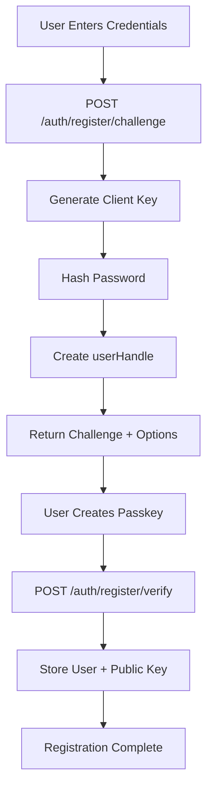
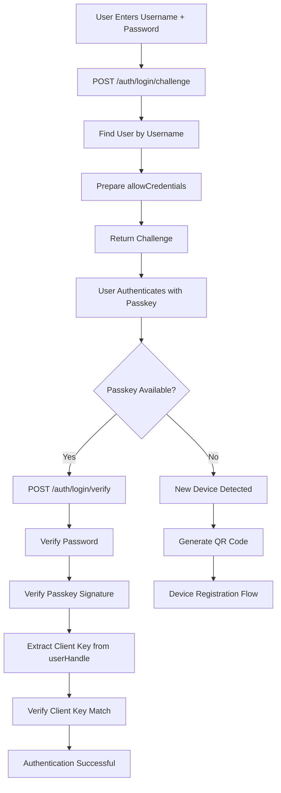
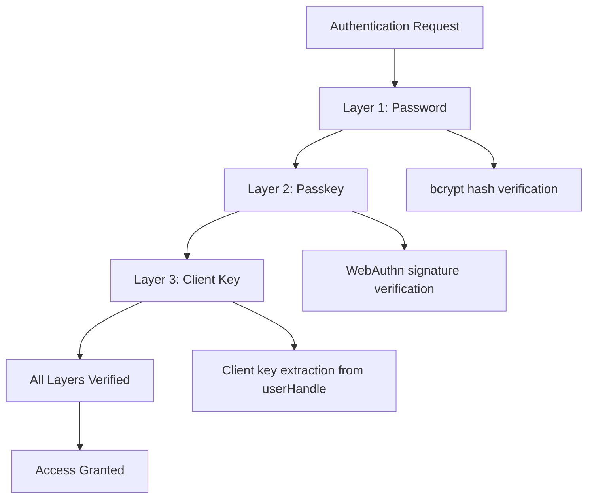
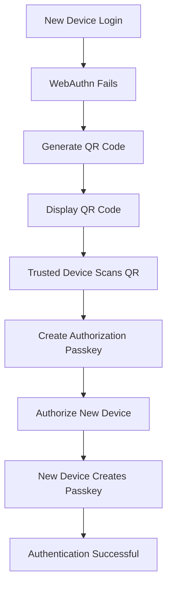
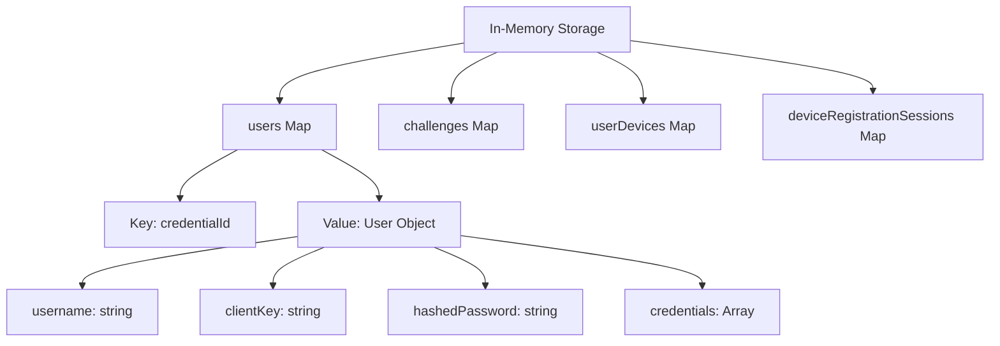
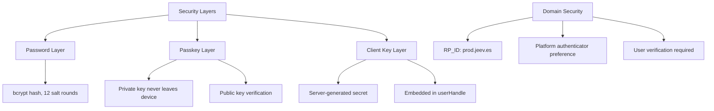
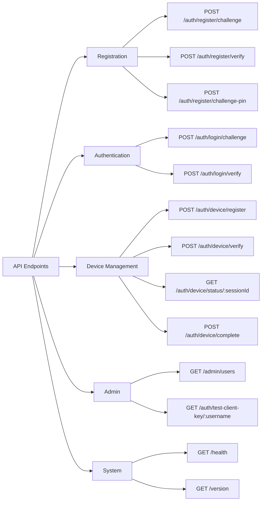

# 🔐 FIDO2 WebAuthn Authentication Flow Diagram

## System Overview

```
┌─────────────────────────────────────────────────────────────────────────────┐
│                        FIDO2 Passwordless Authentication System             │
│                              Version 1.1.0                                  │
└─────────────────────────────────────────────────────────────────────────────┘
```

## 1. User Registration Flow



## 2. User Authentication Flow



## 3. Multi-Factor Authentication



## 4. New Device Registration



## 5. Data Storage Structure



## 6. Security Architecture



## 7. API Endpoints



## Key Features Summary

- **Multi-Factor Authentication**: Password + Passkey + Client Key
- **Device Management**: QR code-based new device registration
- **PIN Support**: Hardware security key integration
- **Dynamic Versioning**: Automatic version management
- **Comprehensive Logging**: Cryptographic key tracking
- **Security First**: No private key transmission
- **Browser Compatible**: Works across major browsers
- **Password Manager Ready**: Optimized for Keeper, 1Password, etc. 