# 🔐 FIDO2 WebAuthn Authentication Flow Diagram

## System Overview

```
┌─────────────────────────────────────────────────────────────────────────────┐
│                        FIDO2 Passwordless Authentication System             │
│                              Version 1.1.0                                  │
└─────────────────────────────────────────────────────────────────────────────┘
```

## 1. User Registration Flow


## 2. User Authentication Flow

```mermaid
sequenceDiagram
    participant U as User
    participant FE as Frontend
    participant BE as Backend
    participant PM as Password Manager
    participant Auth as Authenticator

    U->>FE: Enter username + password
    FE->>BE: POST /auth/login/challenge
    Note over BE: Find user by username
    Note over BE: Prepare allowCredentials
    BE->>FE: Return challenge + publicKey options
    
    U->>FE: Click "Authenticate"
    FE->>Auth: navigator.credentials.get()
    Note over Auth: Verify user (biometric/PIN)
    Note over Auth: Sign challenge with private key
    Auth->>FE: Return assertion
    
    FE->>BE: POST /auth/login/verify
    Note over BE: Verify password (bcrypt)
    Note over BE: Verify assertion signature
    Note over BE: Extract client key from userHandle
    Note over BE: Verify client key match
    Note over BE: Update device usage
    BE->>FE: Success + device list
    
    Note over U: Multi-factor authentication:
    Note over U: ✅ Password verified
    Note over U: ✅ Passkey verified  
    Note over U: ✅ Client key verified
```



## 3. PIN-Based Registration Flow


## 4. New Device Registration Flow


## 5. Cryptographic Key Flow


## 6. Data Storage Structure


## 7. Security Architecture


## 8. Error Handling Flow


## 9. API Endpoints Overview


## 10. Browser Compatibility

```mermaid
graph TD
    A[Browser Support] --> B[Chrome/Edge]
    A --> C[Safari]
    A --> D[Firefox]
    
    B --> E[Full WebAuthn support]
    B --> F[Platform authenticators]
    B --> G[Cross-platform authenticators]
    
    C --> H[WebAuthn support]
    C --> I[Touch ID/Face ID]
    C --> J[Requires residentKey: "required"]
    C --> K[Longer timeout needed]
    
    D --> L[WebAuthn support]
    F --> M[Platform authenticators]
    F --> N[Security keys]
    
    O[Password Manager Integration] --> P[Keeper Secret Manager]
    O --> Q[1Password]
    O --> R[Bitwarden]
    
    P --> S[Client key in displayName]
    P --> T[Partial key in name field]
    P --> U[localStorage backup]
```

---

## Key Features Summary

- **Multi-Factor Authentication**: Password + Passkey + Client Key
- **Device Management**: QR code-based new device registration
- **PIN Support**: Hardware security key integration
- **Dynamic Versioning**: Automatic version management
- **Comprehensive Logging**: Cryptographic key tracking
- **Security First**: No private key transmission
- **Browser Compatible**: Works across major browsers
- **Password Manager Ready**: Optimized for Keeper, 1Password, etc. 